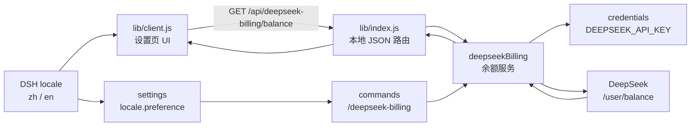

# AGENTS.md

本文件约束本仓库中的代码代理。默认使用中文沟通，优先做最小、可验证的修改。

## 项目

`dsh-deepseek-billing` 是 DSH 双端插件：宿主读取 DeepSeek API 余额并提供 `/deepseek-billing` 斜杠命令，客户端在“设置 → 计费 / Billing”展示余额，并随 DSH 在中英文间实时切换。

## 架构



## 文件

```text
package.json       DSH bundle/client 声明与包入口
cordis.patch.yml   按包名插入宿主插件
lib/index.js       凭据、DeepSeek 请求、余额服务、HTTP 路由和斜杠命令
lib/client.js      设置页 UI、CSS、请求状态和中英文词典
test/index.test.js 宿主服务、错误码、路由、命令和配置测试
test/client.test.js 客户端模块、注入和国际化契约测试
docs/design/       设计文档（索引见 docs/design/README.md，覆盖实现、运行契约、设计取舍和验证清单）
docs/image_*.png   README 使用的中英文截图
README.md          安装、配置和使用说明
```

真实入口只有 `lib/index.js` 和 `lib/client.js`。不要手动建符号链接或写死本机路径。

## 宿主端规则

- API Key 只能通过 `ctx.credentials.resolve('DEEPSEEK_API_KEY')` 获取。
- 不得把 API Key 写入代码、日志、响应、文档、截图或测试数据。
- 凭据值必须先 `trim()`；缺失、非字符串或全空白统一报 `missing_credential`。
- 保留请求超时、取消、HTTP 状态、JSON 和 `balance_infos` 校验。
- `balance_infos[0]` 为空时返回 `null`；非空时必须校验 `currency`、`total_balance`、`granted_balance`、`topped_up_balance` 为非空字符串，并只返回这四个白名单字段。
- 不在插件启动时主动查询余额。
- 本地路由仅允许 `GET`，保留 `Cache-Control: no-store`。
- HTTP 失败响应统一使用 `{ ok: false, code }`；`code` 只能取下方固定值，缺失或未知码兜底为 `billing_service_unavailable`，不得返回堆栈、内部路径和上游正文。
- `config.endpoint` 会接收 Bearer 凭据，只能视为受信任的宿主配置；改变、移除或收紧该配置前按公开接口变更处理。
- 保留 `commands` 注入和 `/deepseek-billing` 命令；命令必须复用 `deepseekBilling.getBalance()`，不得另建凭据或请求链路。
- 命令可见文本只读取宿主 `settings` 中的 `locale.preference`；zh/en 下本地化发现菜单说明、主标签、空态、固定错误码和用法提示，服务读取失败、偏好缺失或未知时返回英文菜单说明、语言中性余额文本、固定英文用法提示或稳定错误码，不得因此让余额查询失败。
- 监听 `settings/updated` 的 `locale` 变化；菜单说明发生变化时先注销再重新注册命令，依靠 `commands/change` 让已打开的客户端目录重新拉取。插件卸载时必须同时清理监听器和当前命令注册。
- `/deepseek-billing` 不接受参数；handler 必须检查 `invocation.rawInput`，多余输入返回本地化用法错误。

错误码固定为：

```text
missing_credential
balance_timeout
balance_fetch_failed
billing_service_unavailable
invalid_response
```

新增错误码时同步更新 `ERROR_CODES`、`ERROR_KEY`、客户端中英文词典、宿主 `COMMAND_MESSAGES`、测试、设计文档和 README。

## 客户端规则

- 保留 `window.__ModuleLoader__.load(...)` 模块外壳和 `require('react')`。
- `exports.inject` 必须覆盖实际使用的 `slots`、`locale` 服务。
- 新请求前及组件卸载时取消旧请求，防止过期结果覆盖新状态。
- CSS 使用 `ds-billing-` 前缀；颜色跟随宿主 `currentColor`。
- UI 保持简洁：总余额为主，充值与赠送余额为次，不添加虚构图表或指标。
- 保留窄屏适配、焦点样式、禁用状态和 ARIA 文案。

## 国际化

- 命名空间固定为 `settings.billing`。
- `zh`、`en` 必须键完全一致；所有可见文案使用 `t(key)`。
- 侧边栏使用 `label: () => t('nav')`，不能写死语言。
- 使用 `React.useSyncExternalStore` 订阅 `ctx.locale`，切换语言后立即更新。
- HTTP 路由只返回错误码，翻译由客户端完成；宿主斜杠命令直接返回面向用户的本地化文本。

## 修改与验证

- 保留用户已有改动，不处理无关文件。
- 标识符保持一致：包名、客户端模块 ID 与 patch `name` 为 `dsh-deepseek-billing`；宿主插件 `name` 与 patch `id` 为 `deepseek-billing`。
- 改变安装方式、公开接口、包名或删除文件前先征得用户同意。
- UI、安装方式、错误码或配置变化时同步更新 README；UI 变化时更新 `docs/` 截图。
- 宿主逻辑变化时同步更新 `test/index.test.js`；模块外壳、注入或词典变化时同步更新 `test/client.test.js`。
- 测试使用 Node.js 内置 `node:test`，不得依赖真实 DSH、真实 DeepSeek 请求或真实 API Key；替换 `globalThis.fetch`、`window`、`console.error` 等全局对象时必须在 `finally` 中恢复。

至少运行：

```bash
node --test
node --check lib/index.js
node --check lib/client.js
node -e "JSON.parse(require('fs').readFileSync('package.json'))"
```

`test/client.test.js` 只做客户端契约校验，不替代真实渲染。手动检查：正常余额、缺失凭据、刷新与旧请求取消、中文/英文切换、明暗主题、窄屏布局，以及 `/deepseek-billing` 的菜单说明在 zh/en 间实时更新、无持久化语言回退、错误状态和带多余参数时的输出。本地链接安装可由 Web 客户端 HMR 检测；GitHub 安装需重新安装/更新并重启 DSH Web，必要时 `Ctrl+F5`。
