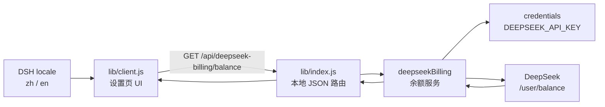

# AGENTS.md

本文件约束本仓库中的代码代理。默认使用中文沟通，优先做最小、可验证的修改。

## 项目

`dsh-deepseek-billing` 是 DSH 双端插件：宿主读取 DeepSeek API 余额，客户端在“设置 → 计费 / Billing”展示余额，并随 DSH 在中英文间实时切换。

## 架构



## 文件

```text
package.json       DSH bundle/client 声明与包入口
cordis.patch.yml   按包名插入宿主插件
lib/index.js       凭据、DeepSeek 请求、余额服务和 HTTP 路由
lib/client.js      设置页 UI、CSS、请求状态和中英文词典
docs/              README 使用的中英文截图
README.md          安装、配置和使用说明
```

真实入口只有 `lib/index.js` 和 `lib/client.js`。不要手动建符号链接或写死本机路径。

## 宿主端规则

- API Key 只能通过 `ctx.credentials.resolve('DEEPSEEK_API_KEY')` 获取。
- 不得把 API Key 写入代码、日志、响应、文档、截图或测试数据。
- 保留请求超时、取消、HTTP 状态、JSON 和 `balance_infos` 校验。
- 不在插件启动时主动查询余额。
- 本地路由仅允许 `GET`，保留 `Cache-Control: no-store`。
- 客户端只接收余额或稳定错误码，不接收堆栈、内部路径和上游正文。

错误码固定为：

```text
missing_credential
balance_timeout
balance_fetch_failed
billing_service_unavailable
invalid_response
```

新增错误码时同步更新 `ERROR_KEY`、中英文词典和 README。

## 客户端规则

- 保留 `window.__ModuleLoader__.load(...)` 模块外壳和 `require('react')`。
- `exports.inject` 必须覆盖实际使用的 `slots`、`locale` 服务。
- 新请求前及组件卸载时取消旧请求，防止过期结果覆盖新状态。
- CSS 使用 `ds-billing-` 前缀；颜色跟随宿主 `currentColor`。
- UI 保持简洁：总余额为主，充值与赠送余额为次，不添加虚构图表或指标。
- 保留窄屏适配、焦点样式、禁用状态和 ARIA 文案。

## 国际化

- 命名空间固定为 `settings.billing`。
- `zh`、`en` 必须键完全一致；所有可见文案使用 `t(key)`。
- 侧边栏使用 `label: () => t('nav')`，不能写死语言。
- 使用 `React.useSyncExternalStore` 订阅 `ctx.locale`，切换语言后立即更新。
- 服务端只返回错误码，翻译由客户端完成。

## 修改与验证

- 保留用户已有改动，不处理无关文件。
- 标识符保持一致：包名、客户端模块 ID 与 patch `name` 为 `dsh-deepseek-billing`；宿主插件 `name` 与 patch `id` 为 `deepseek-billing`。
- 改变安装方式、公开接口、包名或删除文件前先征得用户同意。
- UI、安装方式、错误码或配置变化时同步更新 README；UI 变化时更新 `docs/` 截图。

至少运行：

```bash
node --check lib/index.js
node --check lib/client.js
node -e "JSON.parse(require('fs').readFileSync('package.json'))"
```

手动检查：正常余额、缺失凭据、刷新、中文/英文切换、明暗主题和窄屏布局。本地链接安装可由 Web 客户端 HMR 检测；GitHub 安装需重新安装/更新并重启 DSH Web，必要时 `Ctrl+F5`。
