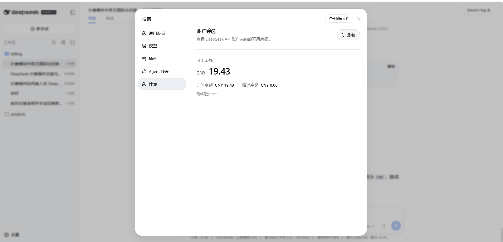
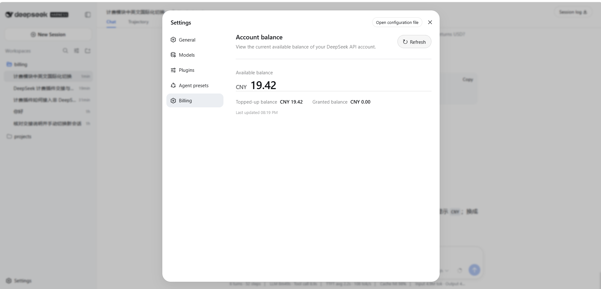

<h1 align="center">dsh-deepseek-billing</h1>

## 功能概述

在 [DeepSeek Harness](https://github.com/deepseek-ai/deepseek-harness) 的 Web 设置页中增加“计费 / Billing”页面，提供：

- DeepSeek API 可用余额、充值余额和赠送余额展示
- 手动刷新及加载、空数据、错误状态
- 中文、英文实时切换
- 明暗主题与窄屏适配
- API Key 通过 DSH 凭证库安全读取，不会发送到浏览器





## 安装与使用

1. 安装插件：

   ```bash
   dsh plugin --profile web add github:golitter/dsh-deepseek-billing
   ```

2. 在 `$DSH_HOME/.credentials.yaml` 中配置 DeepSeek API Key：

   ```yaml
   DEEPSEEK_API_KEY: sk-xxxxxxxxxxxxxxxx
   ```

3. 启动 DSH Web：

   ```bash
   dsh --profile web
   ```

4. 打开“设置 → 计费 / Billing”查看余额；点击“刷新 / Refresh”可重新获取。
