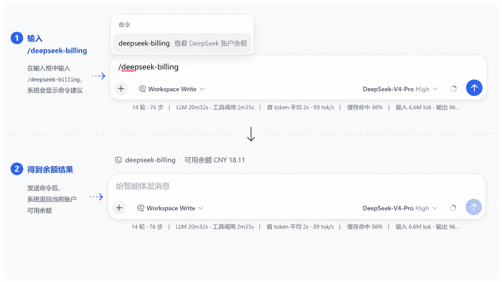

<h1 align="center">dsh-deepseek-billing</h1>

## 功能概述

在 [DeepSeek Harness](https://github.com/deepseek-ai/deepseek-harness) 的 Web 设置页中增加“计费 / Billing”页面，提供：

- DeepSeek API 可用余额、充值余额和赠送余额展示
- 手动刷新及加载、空数据、错误状态
- 中文、英文实时切换
- 明暗主题与窄屏适配
- API Key 通过 DSH 凭证库安全读取，不会发送到浏览器
- 对话内斜杠命令 `/deepseek-billing` 快速返回余额；发现菜单说明和命令文案在宿主已保存语言偏好时跟随中英文

## 第一性原理

这个插件只解决一个最基本的问题：**在不暴露 API Key 的前提下，让用户可靠地看到 DeepSeek 账户的真实余额。**

因此，当前功能有意保持克制：宿主负责安全读取凭据并请求 DeepSeek 官方余额接口，客户端只展示接口返回的余额，并提供手动刷新和稳定的错误反馈。插件不实现消费历史、趋势图、用量预测、余额告警、自动充值或 API Key 管理等扩展能力；这些功能要么缺少可靠的数据来源，要么超出了“查询余额”这一核心职责。没有实现它们是基于第一性原理做出的范围选择，而不是用虚构数据填充界面。

## 安装与使用

1. 安装插件：

   ```bash
   dsh plugin --profile web add github:golitter/dsh-deepseek-billing
   ```

2. 在 `$DSH_HOME/.credentials.yaml` 中配置 DeepSeek API Key：

   ```yaml
   DEEPSEEK_API_KEY: sk-xxxxxxxxxxxxxxxx
   ```

3. 启动 DSH Web：

   ```bash
   dsh --profile web
   ```

4. 打开“设置 → 计费 / Billing”查看余额；点击“刷新 / Refresh”可重新获取。

   

   

5. 也可在对话中直接输入无参数命令 `/deepseek-billing` 快速查看余额（返回「可用余额标签 + 币种 + 金额」）。宿主已保存 `zh`/`en` 偏好时，斜杠菜单说明、标签、空态、错误和用法提示跟随语言并在切换后更新；远程浏览器仅有进程内语言或偏好不可用时，菜单说明回退英文，结果回退为不带标签的「币种 + 金额」、固定英文用法提示及稳定错误码。

   

## 配置

以下配置键均可选（写在插件宿主配置里）。默认配置行为不变；已有自定义 `endpoint` 的配置需要显式增加 `allowCustomEndpoint: true` 迁移：

| 键 | 默认值 | 说明 |
|---|---|---|
| `endpoint` | `https://api.deepseek.com/user/balance` | 余额接口地址。`allowCustomEndpoint: false` 时必须是官方默认值。 |
| `timeoutMs` | `10000` | 覆盖完整请求的超时（响应头 + 响应体读取 + 解析 + 校验）。 |
| `allowCustomEndpoint` | `false` | 必须是布尔值 `true`/`false`。`false` 时锁定官方默认 endpoint；`true` 后允许自定义 `https:`，或 loopback 明文 HTTP 代理（`http://127.0.0.1` / `http://localhost`）。 |
| `maxRequestsPerMinute` | `30` | 每客户端每分钟的低频限流上限，超限返回 `429`。 |

示例（启用本地 loopback 代理）：

```js
{
  endpoint: 'http://127.0.0.1:8080/user/balance',
  allowCustomEndpoint: true
}
```

## 安全说明

- API Key 只在宿主端经 DSH 凭证库读取，请求 DeepSeek 官方接口时以 `Authorization: Bearer` 发送，绝不写入日志、响应或发送到浏览器。
- **自定义 `endpoint`（尤其是本地代理）会收到完整的 Bearer API Key**，请在信任该目标的前提下再修改配置；默认锁定官方 HTTPS 地址，只有 `allowCustomEndpoint: true` 才允许改动，且始终拒绝内嵌用户名/密码、fragment、非 `http(s):` 协议、非 loopback 明文 HTTP，以及跨域自动重定向。
- DSH Web 是绑定 loopback（`127.0.0.1`）的单用户本地应用，没有登录态（`--host 0.0.0.0` 已被 DSH 主动拒绝）。余额路由读取 API Key、发起上游调用、返回账户数据，属高权限操作，因此复刻 DSH `/api` 的 browser-trust fence 并**锁定本机**：请求 `Host` 必须为 loopback、拒绝 cross-site 与跨域 `Origin`，未通过返回 `403 { ok:false, code }`。`--trusted-host`（DNS-rebinding 白名单，非鉴权）不放开余额。
- 余额响应体受 64 KiB 硬上限约束，余额字段受长度上限约束；服务端日志只记录稳定错误码，不含密钥、`Authorization` 头、上游正文或 endpoint query。
- 所有失败响应统一为 `{ ok: false, code }`，`code` 取固定错误码，客户端按当前语言翻译。
