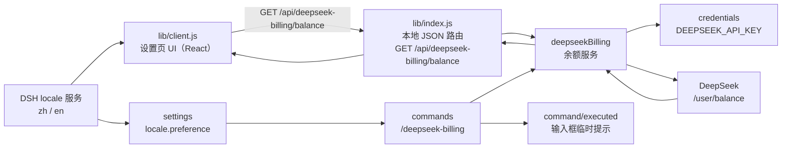

# dsh-deepseek-billing 设计文档

> 版本：对应 package.json `0.1.0`。本文记录当前实现与设计取舍；运行契约以 `package.json`、`lib/index.js` 和 `lib/client.js` 为准。

## 1. 概述

`dsh-deepseek-billing` 是一个 **DSH 双端（dual-face）插件**，在 DeepSeek Harness 的 Web 设置页里展示 DeepSeek API 账户余额：

- **宿主半（host half）**：读取 DeepSeek `/user/balance` 接口，以服务 `deepseekBilling` 暴露给宿主，通过本地 HTTP 路由把结果给浏览器，并注册 `/deepseek-billing` 斜杠命令在对话中直接返回余额。
- **客户端半（client half）**：在「设置 → 计费 / Billing」区块渲染余额，接入 DSH 的 `locale` 服务，并把本地执行完成的余额命令结果送到对应会话的输入提示，让新建空白会话保持 Hero 布局。

两个半共用同一个 npm 包：宿主端通过 bundle patch 注入，客户端通过 `dsh.client` 声明被 `clientModules` 服务扫描进浏览器。

## 2. 设计目标与非目标

### 目标

- 用最少配置把余额展示进 DSH 设置页（无需 `--patch`、无需手动符号链接）。
- 只读展示，不提供充值/改密等写操作。
- 界面文案、时间格式完全跟随 DSH 的 `zh`/`en` 语言选择，实时切换、无需刷新。
- Web 余额查询失败时，HTTP 路由只回稳定错误码，错误文案由客户端按语言翻译，避免英文界面出现中文报错；宿主斜杠命令按已持久化语言直接返回可见文案。
- 凭据只走 DSH 凭证库；插件不另行持久化，也不写入日志、响应或截图。

### 非目标

- 不做汇率换算或币种换算：`currency` 是账户事实，原样透传，不随语言变化。
- 不做余额历史曲线、消耗统计、告警等增值功能。
- 不在插件启动时主动查询余额（避免拖慢启动与无谓的 API 消耗）。

## 3. 整体架构



数据流分三条：

1. **余额链路（请求/响应）**：客户端 `fetch` 本地路由 → 路由调用 `deepseekBilling.getBalance()` → 服务从 `credentials` 解析 `DEEPSEEK_API_KEY` → 携带 `Authorization: Bearer` 请求 DeepSeek `/user/balance` → 校验并白名单化首条余额 → 客户端渲染。
2. **语言链路**：浏览器 `locale` 服务驱动客户端 UI 的文案和时间格式，并把显式选择持久化为宿主 `settings` 的 `locale.preference`；该偏好只影响命令呈现，不改变 DeepSeek 请求。
3. **命令链路**：对话输入 `/deepseek-billing` → 宿主 `commands` 服务复用 `deepseekBilling.getBalance()` → 本地客户端收到 `command/executed` 后，把该命令的成功或错误文本送到对应会话的 composer notice。空白会话保持 Hero，不挂载对话记录页；可见文案跟随宿主侧已持久化的 locale 偏好，不可用时回退为无标签余额、破折号、稳定错误码或固定英文用法提示。

## 4. 打包与分发模型

包是「一个包、两个入口」的双端包，靠三处声明协同：

| 声明 | 位置 | 作用 |
|---|---|---|
| `exports["./client"]` | package.json | 指向 `./lib/client.js`，`clientModules` 据此定位客户端 bundle |
| `dsh.bundle.patch` | package.json | 指向 `./cordis.patch.yml`，安装后自动写入 profile 的 `dsh.profile.bundles` |
| `dsh.client` | package.json | 声明客户端平台与注入依赖，供 `clientModules` 扫描 |

### 4.1 宿主半如何被加载

`cordis.patch.yml` 按包名插入自身：

```yaml
- insert:
    - id: deepseek-billing
      name: 'dsh-deepseek-billing'
```

`dsh plugin --profile web add github:golitter/dsh-deepseek-billing` 会把 `add` 参数转发给 profile 目录里的 `pnpm`，随后 CLI 根据已安装包的 `dsh.bundle.patch` 声明，把包名追加进 `dsh.profile.bundles` 层栈；`dsh --profile web` 启动时逐层加载，宿主半 `lib/index.js` 被 cordis 加载。

### 4.2 客户端半如何被发现

DSH 的 `clientModules` 服务（Node 半）扫描宿主 Loader 里声明了 `dsh.client` 的包，流程为：

1. 校验 `dsh.client`（`platform: "web"`、`inject: string[]`）。
2. 解析 `exports["./client"]` 得到相对路径（本包为 `./lib/client.js`）。
3. 以包名为模块 id，把 bundle 通过 `/plugins/dsh-deepseek-billing/client.js?rev=<hash>` 提供给浏览器。
4. 把入口图注入 `index.html` 的 `<head>`，写成 `window.__DSH_BOOT__`，shell bundle 据此加载。

由于本包没有构建脚本，`client.js` 就是最终分发文件，`clientModules` 直接读 `lib/client.js`（无需 `pnpm run build`，也没有 `prepare` 脚本）。

### 4.3 三类「inject」的区别

容易混淆，务必区分：

- **`lib/index.js` 的 `export const inject`**：宿主端 Cordis 服务依赖，当前为 `credentials`、`webServer`、`commands`；其中 `settings` 通过 `ctx.get('settings')` 可选读取，不作为硬注入，缺失时命令回退中性文案。
- **package.json 的 `dsh.client.inject`**：客户端模块图边，值是**包名/模块 id**（`@deepseek-ai/dsh-client-runtime`、`@deepseek-ai/dsh-client-locale`、`@deepseek-ai/dsh-client-ui-conversation`、`@deepseek-ai/dsh-client-ui-commands`、`@deepseek-ai/dsh-client-ui-settings-general`），决定浏览器端 bundle 的加载顺序。
- **`lib/client.js` 的 `exports.inject`**：cordis **服务**依赖，值 `["slots", "locale", "sessions"]`，决定浏览器端 cordis 上下文里可用哪些服务。

## 5. 宿主端设计（lib/index.js）

### 5.1 常量与错误码

```js
export const name = 'deepseek-billing'
export const inject = ['credentials', 'webServer', 'commands']

const DEFAULT_ENDPOINT = 'https://api.deepseek.com/user/balance'
const CREDENTIAL_REF = 'DEEPSEEK_API_KEY'
const DEFAULT_TIMEOUT_MS = 10_000
const DEFAULT_MAX_REQUESTS_PER_MINUTE = 30
const MAX_RESPONSE_BYTES = 64 * 1024
const CURRENCY_MAX_LENGTH = 16
const AMOUNT_MAX_LENGTH = 128
```

宿主配置键（均可选；默认配置行为不变，已有自定义 `endpoint` 需显式增加 `allowCustomEndpoint: true` 迁移）：

| 键 | 默认值 | 说明 |
|---|---|---|
| `endpoint` | `https://api.deepseek.com/user/balance` | 余额接口地址。`allowCustomEndpoint: false` 时必须是官方默认值 |
| `timeoutMs` | `10000` | 覆盖完整请求（响应头 + 响应体读取 + 解析 + 校验）的超时 |
| `allowCustomEndpoint` | `false` | 必须是布尔值 `true`/`false`；`false` 时锁定官方默认 endpoint，`true` 时允许自定义 `https:`（或 loopback 明文 HTTP 代理） |
| `maxRequestsPerMinute` | `30` | 每客户端每分钟的低频限流上限 |

`endpoint` 始终拒绝：相对/非法 URL、内嵌用户名/密码、fragment、非 `http(s):` 协议；`http:` 仅当 `allowCustomEndpoint: true` 且目标为 loopback（`127.0.0.1`/`localhost`/`[::1]`）时放行。

错误码固定为五个稳定值，通过 `codedError(code, message)` 附着在 `Error.code` 上：

| 错误码 | 触发条件 | 中文文案 | English |
|---|---|---|---|
| `missing_credential` | 凭证值缺失、不是字符串或 `trim()` 后为空 | 未配置 DeepSeek API 密钥 | DeepSeek API key is not configured |
| `balance_timeout` | 上游请求超过 `timeoutMs`（`AbortError`） | 获取余额超时 | Balance request timed out |
| `balance_fetch_failed` | `fetch` 网络层失败（非超时） | 获取余额失败 | Failed to fetch balance |
| `billing_service_unavailable` | 上游返回非 2xx、请求方法不是 GET，或路由捕获缺失/未知 `.code` 的异常 | 计费服务暂不可用 | Billing service is temporarily unavailable |
| `invalid_response` | 上游返回非法 JSON / 非法 payload / 非法余额条目 | 余额接口返回异常数据 | Balance endpoint returned unexpected data |

### 5.2 服务 `deepseekBilling`

`getBalance()` 是唯一对外能力，流程：

1. `await ctx.credentials.resolve(CREDENTIAL_REF)` 取密钥并 `trim()`；缺失、非字符串或全空白 → `missing_credential`。
2. 新建 `AbortController`，`setTimeout` 到 `timeoutMs` 后 `abort()`；定时器在**最外层 `finally`** 清理，因此超时覆盖「响应头 + 响应体读取 + JSON 解析 + 校验」全过程，而不是只覆盖等待响应头的阶段。
3. `fetch(endpoint, { authorization: Bearer ..., signal, redirect: 'manual' })`：
   - 捕获 `AbortError` → `balance_timeout`（无论发生在 `fetch` 还是随后的响应体读取）；
   - 其他网络异常 → `balance_fetch_failed`；
   - 已带稳定 `.code` 的错误原样透传。
4. `!response.ok`（含 `redirect: 'manual'` 下直接返回的 3xx）→ `billing_service_unavailable`（附带数值 `status` 供日志，但不进响应）。
5. 受限读取响应体：先看 `Content-Length`，明显超过 `MAX_RESPONSE_BYTES`（64 KiB）立即拒绝；否则流式读取并在超限时中止，然后再 `JSON.parse()`。解析失败 → `invalid_response`。
6. `payload.balance_infos` 非数组 → `invalid_response`。
7. 取 `balance_infos[0]`：`undefined` 返回 `null`；非普通对象，或四个必要字段缺失、为空、不是字符串 → `invalid_response`；`currency` 超过 16 字符、任一金额超过 128 字符 → `invalid_response`。
8. 构造只包含 `currency`、`total_balance`、`granted_balance`、`topped_up_balance` 的新对象返回，避免把上游未来新增的字段自动暴露给浏览器。

并发调用会被合并：同一时刻多个 `getBalance()` 只共享一次上游请求，共享的 promise 在 settle 后清空。启动时不调用 `getBalance()`，只在请求到达时执行。

### 5.3 余额数据模型

DeepSeek 返回（客户端实际用到的字段）：

```jsonc
{
  "currency": "CNY",            // 币种，原样透传
  "total_balance": "19.47",     // 可用余额（主展示）
  "granted_balance": "0.00",    // 赠送余额
  "topped_up_balance": "19.47"  // 充值余额
}
```

宿主半校验响应容器、`balance_infos` 数组、首条记录及四个必要字段，并只向客户端返回这些字段。金额仍以 DeepSeek 返回的非空字符串展示，不做计算或币种换算。

### 5.4 HTTP 路由

`GET /api/deepseek-billing/balance`（`kind: 'exact'`）：

| 场景 | 状态码 | 响应体 |
|---|---|---|
| 成功 | `200` | `{ "ok": true, "balance": {...} }` |
| 未通过 browser-trust fence | `403` | `{ "ok": false, "code": "billing_service_unavailable" }` |
| 非 GET | `405` | `{ "ok": false, "code": "billing_service_unavailable" }` + `Allow: GET` |
| 超过 `maxRequestsPerMinute` | `429` | `{ "ok": false, "code": "billing_service_unavailable" }` |
| 任何 `getBalance()` 失败 | `502` | `{ "ok": false, "code": "<稳定错误码>" }` |

统一响应头 `Cache-Control: no-store`（余额是敏感、易变数据），所有失败态（含 `403`）都返回 `{ ok: false, code }`。路由在方法检查、限流、读取凭据之前先复刻 DSH 自己的 `/api` browser-trust fence，并以**空信任列表**把该路由锁定为 loopback-only（拒绝 `Sec-Fetch-Site: cross-site`、拒绝跨域 `Origin`）；这是因为 `exact` 路由会在 webserver 的匹配中优先于 `/api` 前缀路由，从而绕过连接层自带的那道 fence，而余额路由读取 API Key、发起上游调用、返回账户数据，属于与 DSH `credentials`/`settings` 平面同级的高权限路由，因此 `--trusted-host`（DNS-rebinding 白名单，非鉴权）不放开它。路由只允许五个固定错误码；缺失或未知 `.code` 统一兜底为 `billing_service_unavailable`。限流按客户端地址（loopback 单用户部署下即全局）固定窗口计数，`429` 在读取凭据、发起上游请求之前返回。

服务端日志只记录稳定错误码（以及观测到的数值 HTTP 状态），**不记录**：API Key、`Authorization` 头、上游响应正文、完整自定义 endpoint（尤其是 query string）、凭据服务抛出的原始消息。堆栈、内部路径、上游正文绝不进响应体。

### 5.5 斜杠命令 `/deepseek-billing`

宿主半通过 `ctx.commands.register(...)` 注册命令 `deepseek-billing`（`commands` 是 DSH 自带的宿主服务，参考内置 `/goal`）。命令名去斜杠、全小写；`parseCommand` 使用 `/^\/([a-z][a-z0-9_-]*)(?=$|[\t\n\r ])/u`，因此 `deepseek-billing` 合法，且命令名后必须是输入结束或空白。

handler 复用 `deepseekBilling.getBalance()`；主标签、空态和固定错误码跟随宿主侧 locale 偏好，无法确定语言时回退为语言中性文本或稳定错误码：

| 场景 | 呈现或返回 |
|---|---|
| 发现菜单说明（zh） | `查看 DeepSeek 账户余额` |
| 发现菜单说明（en / 无偏好） | `show the DeepSeek account balance` |
| 成功且有余额（zh） | `{ kind: 'success', text: '可用余额 CNY 12.34' }` |
| 成功且有余额（en） | `{ kind: 'success', text: 'Available balance CNY 12.34' }` |
| 成功但无余额（zh） | `{ kind: 'success', text: '暂无余额信息' }` |
| 成功但无余额（无偏好） | `{ kind: 'success', text: '—' }` |
| 失败（zh/en） | `{ kind: 'error', text: '<本地化错误文案>' }` |
| 失败（无偏好） | `{ kind: 'error', text: '<稳定错误码>' }`（缺失或未知 `.code` 兜底 `billing_service_unavailable`） |
| 带额外参数（zh） | `{ kind: 'error', text: '此命令不接受参数，请直接输入 /deepseek-billing' }` |

命令不接受参数，handler 先把 `invocation.rawInput` 防御性归一为非字符串（缺失/`null`/数字按空串处理）再 `trim()`，非空时直接返回本地化用法错误，不发起余额请求。

语言偏好是 Host-backed：`dsh-client-locale` 的宿主半把 `locale.preference` 注册进宿主 `settings` 服务并持久化到 `settings.yaml`。命令 handler 经 `ctx.get('settings')` 读 `settings.get('locale').preference`（`zh`/`en`）选择文案；`settings` 服务缺失、读取失败或 `preference` 未知时回退为无标签的 `CNY 12.34`、空态 `—`、稳定错误码或固定英文用法提示，语言读取本身不会阻断余额查询。

命令的 `description` 就是截图中斜杠发现菜单的灰色摘要：zh 为“查看 DeepSeek 账户余额”，en 与无 Host 偏好时为 `show the DeepSeek account balance`。插件监听 `settings/updated` 的 `locale` 变化；摘要变化时注销并重新注册命令，`commands` 服务发出 `commands/change`，客户端目录随即重新拉取，因此持久化语言切换后无需重启。

## 6. 客户端设计（lib/client.js）

### 6.1 模块外壳与注入

```js
window.__ModuleLoader__.load({
  id: "dsh-deepseek-billing",
  factory: (require) => { /* ... */ exports.apply = apply; exports.inject = ["slots", "locale", "sessions"]; return module.exports; }
});
```

`require('react')` 复用宿主已加载的 React（`peerDependencies` 声明 `react`）。注入 `slots`（注册设置区块）、`locale`（词典 + 实时翻译）与 `sessions`（按本地命令回执定位对应会话的输入提示出口）。

### 6.2 空白会话中的命令提示

DSH 把纯通用 `command` 节点视为控制面内容，因此仅有命令事件的新会话会留在 Hero，持久命令卡不会挂载。插件监听本地客户端执行确认事件 `command/executed`：

- 只处理 `name === 'deepseek-billing'`、回执到达时仍为当前选中会话、会话仍为 `composerPhase === 'blank'` 且带非空 `result.text` 的本地回执；active 会话继续只显示持久命令卡，避免重复反馈；
- 经 `sessions.scope(sessionId)` 找到准确的会话上下文；
- 成功文本调用 `notify('info', text)`，错误文本调用 `notify('error', text)`；
- 离开会话时只清除插件自己发布且尚未被覆盖的精确 notice；导航后才返回的旧回执直接丢弃；
- 提示使用 DSH 原有输入框 notice UI，不激活会话、不复制余额请求，也不影响其他浏览器标签页。

### 6.3 组件状态机

`BillingSection` 用 `useState` 维护单一状态对象：

```text
{ loading, refreshing, result, updatedAt }
```

- **初始加载**：`result === undefined` 且非刷新 → `loading: true`，显示 `t('loading')`。
- **刷新**：已有结果时点「刷新」→ `refreshing: true`，保留旧结果继续展示。
- **成功**：`result = { ok: true, balance }`。
- **失败**：`result = { ok: false, code }`，渲染错误态。
- **空**：`result.ok` 但 `balance === null` → 显示 `t('empty')`。

### 6.4 请求生命周期与竞态防护

`requestRef` 持有当前 `AbortController`：

1. 每次新请求前 `requestRef.current.abort()` 取消旧请求。
2. 组件卸载时（`useEffect` cleanup）`abort()` 并置空。
3. 回调里比对 `requestRef.current !== controller`，过期响应直接丢弃。
4. `AbortError` 的拒绝静默忽略（是主动取消，不是错误）。

这保证「旧请求结果不会覆盖新请求状态」。

### 6.5 错误码 → 文案

客户端把服务端 `code` 通过 `ERROR_KEY` 映射到词典键，未知码回退 `error.generic`：

```text
billing_service_unavailable -> error.billing_service_unavailable
balance_fetch_failed         -> error.balance_fetch_failed
missing_credential           -> error.missing_credential
balance_timeout              -> error.balance_timeout
invalid_response             -> error.invalid_response
（未知）                      -> error.generic
```

错误态渲染：标题 `t('error.title')` + 正文 `t(errorKey)`。

### 6.6 样式

- CSS 类名统一 `ds-billing-` 前缀。
- 颜色全部用 `currentColor` + `color-mix(in srgb, currentColor X%, transparent)`，自动适配明暗主题。
- `@media (max-width: 620px)` 下 header 纵向堆叠、breakdown 改纵向。
- 保留 `:focus-visible` 焦点环、`:disabled` 状态、`role="status"/"alert"` 与 `aria-label`。

## 7. 国际化设计

### 7.1 locale 服务接入

命名空间固定为 `settings.billing`，在 `apply` 里注册词典：

```js
ctx.effect(() => ctx.locale.register(NS, { zh, en }), 'deepseek-billing: dictionaries')
const t = ctx.locale.bind(NS)
```

`t(key, params?)` 按「当前命名空间 → 公共 `common` → `zh` → 原 key」链查找，支持 `{name}` 模板插值。

### 7.2 词典键集（zh 为来源，en 逐键对应）

| key | zh | en |
|---|---|---|
| `nav` | 计费 | Billing |
| `title` | 账户余额 | Account balance |
| `description` | 查看 DeepSeek API 账户当前的可用余额。 | View the current available balance of your DeepSeek API account. |
| `refresh` | 刷新 | Refresh |
| `refresh.aria` | 刷新余额 | Refresh balance |
| `refreshing` | 刷新中… | Refreshing… |
| `refreshing.aria` | 正在刷新余额 | Refreshing balance |
| `loading` | 正在获取余额… | Fetching balance… |
| `empty` | 暂无余额信息 | No balance information available |
| `available` | 可用余额 | Available balance |
| `toppedUp` | 充值余额 | Topped-up balance |
| `granted` | 赠送余额 | Granted balance |
| `updated` | 最后更新 {time} | Last updated {time} |
| `error.title` | 暂时无法获取余额 | Unable to load balance |
| `error.billing_service_unavailable` | 计费服务暂不可用 | Billing service is temporarily unavailable |
| `error.balance_fetch_failed` | 获取余额失败 | Failed to fetch balance |
| `error.missing_credential` | 未配置 DeepSeek API 密钥 | DeepSeek API key is not configured |
| `error.balance_timeout` | 获取余额超时 | Balance request timed out |
| `error.invalid_response` | 余额接口返回异常数据 | Balance endpoint returned unexpected data |
| `error.generic` | 发生未知错误 | An unknown error occurred |

约束：`zh`、`en` 键必须完全一致（20 键）；新增错误码时同步更新 `ERROR_KEY`、两份词典和 README。

### 7.3 实时切换

侧边栏 label 用 thunk，余额页用 `useSyncExternalStore`：

```js
// 侧边栏（设置面板外壳在 locale revision 变化时重渲染 nav 投影）
label: () => t('nav')

// 余额页：订阅 locale 快照，切换语言立即重渲染
const subscribeLocale = (listener) => ctx.locale.subscribe(listener)
const getLocaleSnapshot = () => ctx.locale.getSnapshot()
const localeSnapshot = React.useSyncExternalStore(subscribeLocale, getLocaleSnapshot)
```

`ctx.locale.getSnapshot()` 返回稳定引用（仅变化时替换），满足 `useSyncExternalStore` 的缓存要求；语言切换 bump `revision` → React 重渲染 → `t(...)` 读取新 `active` 返回新文案，无需刷新。

### 7.4 时间格式跟随语言

```js
const isEnglish = localeSnapshot.active === 'en'
const updatedTime = state.updatedAt
  ? state.updatedAt.toLocaleTimeString(isEnglish ? 'en-US' : 'zh-CN',
      { hour: '2-digit', minute: '2-digit', hour12: isEnglish })
  : '—'
```

- 中文：`zh-CN` + `hour12: false` → `19:31`
- 英文：`en-US` + `hour12: true` → `08:15 PM`

最终用模板插值渲染 `t('updated', { time: updatedTime })`。

### 7.5 币种不做翻译

`currency` 来自 `balance.currency`，缺省 `'CNY'`，原样透传。切语言只改文字，绝不改金额或币种。

## 8. 关键决策与权衡

1. **双端包而非两个包**：一个包同时声明 `dsh.bundle` 与 `dsh.client`，安装一次即完成宿主注入与客户端发现，避免用户分别安装。
2. **HTTP 路由只回错误码**：错误文案是客户端呈现层职责。若 HTTP 路由回本地化文案，英文界面会混入中文。稳定码 + 客户端翻译从根上消除该问题，代价是两端需维护一致的码表（`ERROR_CODES` ↔ `ERROR_KEY` ↔ 词典）。宿主斜杠命令没有客户端翻译层，因此直接按 Host-backed locale 返回可见文案。
3. **币种透传不做换算**：金额/币种是账户事实，任何「按语言换算」都会造成数据错误。代价是 `¥`/`$` 不按语言美化，改用 ISO 代码显示以保真。
4. **手动 `bind` + `useSyncExternalStore` 而非 slot 的 `locale:` 座位**：需要 `snapshot.active` 来按语言格式化时间，`useSyncExternalStore` 直接拿到 `active` 并驱动重渲染；slot 的 `locale:` 座位只注入 `t` 拿不到 `active`。
5. **`502` 作为统一失败态**：本地路由是上游代理，失败即「网关错误」，客户端不看具体 HTTP 状态码、只看 `code`。
6. **命令文案跟随 Host-backed locale**：`locale.preference` 存在宿主 `settings`，命令在宿主端直接读取它选择 zh/en 的发现菜单说明、主标签、空态、错误和用法提示；偏好更新时通过重新注册命令触发客户端目录刷新。`settings` 缺失、读取失败或偏好未知时回退英文菜单说明及语言中性文本/稳定错误码。命令不含「充值/赠送」明细，明细仍在设置页查看。
7. **超时覆盖完整响应**：把 `AbortController` 的生命周期延长到响应体读取、JSON 解析与校验完成之后，`clearTimeout` 只在最外层 `finally` 执行。否则服务器在返回响应头后可以无限缓慢地发送响应体，绕过「仅覆盖 fetch 阶段」的超时。
8. **受限读取 + 硬上限**：不直接 `response.json()` 不受限响应。先看 `Content-Length` 预拒绝，再流式读取并在 64 KiB 超限时中止，最后才 `JSON.parse()`；余额字段另设 16/128 字符长度上限。金额不做格式强校验，也不转 `Number`，避免精度损失。
9. **endpoint 收紧为「默认锁定官方地址」**：`allowCustomEndpoint: false`（默认）时 `endpoint` 必须等于官方 DeepSeek HTTPS 地址；设 `true` 才允许自定义（任意 `https:` 或 loopback 明文 HTTP 代理）。用户名/密码/fragment、非 `http(s):` 协议一律拒绝，`redirect: 'manual'` 保证跨域重定向不会把 `Authorization` 带到新目标。
10. **并发合并 + 低频限流**：同一时刻多个 `getBalance()` 只共享一次上游请求；路由按客户端地址做每分钟固定窗口限流（默认 30 次），超限在读取凭据之前直接返回 `429`。
11. **复刻 DSH 的 browser-trust fence 并锁定 loopback**：`exact` 路由在 webserver 匹配中优先于 `/api` 前缀路由，会绕过连接层自带的 fence，因此路由在入口自行复刻同一道「Host loopback + 同源」判定并返回 `403 { ok:false, code }`。余额读取 API Key、发起上游、返回账户数据，属于高权限操作，故用空信任列表锁定 loopback，与 DSH `credentials`/`settings` 平面一致，`--trusted-host`（DNS-rebinding 白名单，非鉴权）不放开它。
12. **空白会话使用临时命令提示**：不修改 DSH，也不把余额查询复制到客户端。插件只监听当前浏览器的 `command/executed` 回执，将自身命令文本送到当前空白会话的 composer notice；离开会话即清除该插件拥有的提示，导航后才返回的旧回执不再展示。Hero 和其他命令的持久化语义不受影响。

## 9. 安全与隐私

- 密钥只经 `ctx.credentials.resolve('DEEPSEEK_API_KEY')` 读取；DSH 凭证库负责持久化，插件自身不另行保存，也不写进代码、日志、响应、文档、截图或测试数据。
- 凭据会被发送到 `config.endpoint`；默认值是 DeepSeek 官方 HTTPS 地址。该配置属于受信任的宿主配置，不接受浏览器请求参数覆盖。宿主侧校验：`allowCustomEndpoint: false`（默认）时 `endpoint` 必须等于官方地址，设为 `true` 才允许自定义；始终拒绝内嵌用户名/密码、fragment 与非 `http(s):` 协议，明文 HTTP 仅限 loopback；`redirect: 'manual'` 阻止跨域重定向把 `Authorization` 带到新目标。自定义 endpoint（尤其是本地代理）会收到完整 Bearer Key，启用前需自行评估信任边界。
- **访问控制边界**：DSH Web 是绑定 loopback（`127.0.0.1`）的**单用户本地应用，没有登录态**；`--host 0.0.0.0` 被 DSH 主动拒绝，`webServer.register()` 不继承任何鉴权。因此插件未叠加自定义 Token 或会话鉴权，而是在路由入口复刻 DSH 自己的 `/api` browser-trust fence 并以**空信任列表锁定 loopback**（拒绝 cross-site、拒绝跨域 Origin），未通过返回 `403 { ok:false, code }`。这是「单用户 + loopback」部署下对高权限余额路由的轻量保护，`--trusted-host` 是 DNS-rebinding 白名单而非鉴权，故不放开余额。若未来 DSH 提供官方鉴权/会话边界，应改为复用而非自建密钥。
- 响应体流式读取并受 `MAX_RESPONSE_BYTES`（64 KiB）硬上限约束，超限返回 `invalid_response`，不把不受限正文缓冲进内存或转发给浏览器；余额字段另有 16/128 字符长度上限。
- 路由按客户端地址做每分钟固定窗口限流（默认 30 次），超限在读取凭据前返回 `429`；并发请求合并为一次上游请求。
- `Cache-Control: no-store` 阻止浏览器缓存余额。
- 错误响应不含堆栈、内部路径、上游正文；服务端日志只记录稳定错误码（及数值 HTTP 状态），不记录 API Key、`Authorization` 头、上游正文或完整 endpoint/query。
- 路由仅提供 `GET` 只读操作，不接受用户输入作为上游地址或请求头。

## 10. 验证

### 静态检查

```bash
node --check lib/index.js
node --check lib/client.js
node -e "JSON.parse(require('fs').readFileSync('package.json'))"
```

### 自动测试

```bash
npm test
# 或直接运行底层命令
node --test
```

测试使用 Node.js 内置 `node:test`，不依赖真实 DSH、真实 DeepSeek 服务或真实 API Key：

- `test/index.test.js`：28 个宿主端用例，覆盖凭据处理、五个固定错误码、缺失/未知 `.code` 兜底、完整响应超时（含「响应头已返回、响应体挂起」）、网络/HTTP 错误、非法响应、字段白名单与长度上限、64 KiB 响应体上限、空余额、GET/405/429/403 路由（403 返回 `{ ok:false, code }`）、browser-trust fence（Host 非 loopback、缺失 Host、cross-site、跨域 Origin、loopback-only 锁定不受 trusted authority 放宽）、限流（超限不再读取凭据或请求上游）、并发合并、`redirect: 'manual'`、endpoint 校验（默认锁定官方地址、`allowCustomEndpoint` 布尔校验、userinfo/fragment/非法 URL/非 loopback HTTP 白名单）、日志脱敏、`/deepseek-billing` 命令（zh/en 菜单说明与结果本地化、语言更新重注册、设置读取失败、语言中性回退、非字符串 `rawInput`）及配置边界。
- `test/client.test.js`：1 个客户端契约用例，通过真实模块工厂验证模块 ID、`require('react')`、服务注入、词典命名空间、zh/en 键集、动态侧栏标签，以及 `/deepseek-billing` 回执的当前空白会话限定、成功/错误提示、切换清除和导航后过期回执丢弃。

客户端契约测试不渲染 `BillingSection`，因此 fetch 生命周期、卸载取消、刷新交互、状态渲染和时间本地化仍由下方手动清单验证。只有当 UI 频繁变化、出现真实回归或项目接入浏览器 CI 时，再考虑引入渲染级测试。

### 手动检查清单

- 正常余额：显示可用 / 充值 / 赠送余额与「最后更新」时间。
- 缺失凭据：显示「未配置 DeepSeek API 密钥」（zh）/ 对应英文（en），而非原始异常。
- 刷新：点击刷新，旧结果保留、按钮进入「刷新中…」；连续刷新或离开页面后，旧请求不得覆盖新状态。
- 中英文切换：导航、标题、按钮、加载/错误态、时间格式即时切换，无需刷新。
- 明暗主题：颜色跟随 `currentColor` 自动适配。
- 窄屏（≤620px）：header 与 breakdown 纵向布局正常。
- 斜杠命令：`/deepseek-billing` 在宿主持久化语言为 zh/en 时使用对应菜单说明、主标签、空态和错误文案；切换语言后菜单说明无需重启即可更新；无可用偏好或设置读取失败时使用英文菜单说明及语言中性文本/稳定错误码。
- 空白会话命令：在全新空白会话中执行 `/deepseek-billing`，Hero 应保持不变，余额/错误显示在输入框旁的临时提示中，且只有一次上游查询；切换到其他会话再返回新建会话时，旧提示不得重新出现。
- 命令参数：直接输入 `/deepseek-billing` 正常查询；附加任意非空参数时返回本地化用法错误，且不发起 DeepSeek 请求。

### 验证约定

Web profile 挂载了客户端 HMR，会轮询当前已加载包的 `lib/client.js`；只有当该文件就是正在编辑的文件（例如本地链接安装）时，修改才能实时生效。GitHub 安装产生的是 profile 内副本，本仓库改动不会自动同步，需要重新安装/更新并重启 DSH Web；浏览器仍显示旧版本时再使用 `Ctrl+F5`。zh/en 键集一致性由客户端契约测试自动检查。

## 11. 已知限制与后续

- 只展示 `balance_infos[0]`，多币种账户只显示第一条。
- 币种和金额仅校验为非空字符串并设置长度上限，不验证 ISO 币种代码或十进制定点格式。
- 余额只在打开区块 / 手动刷新时拉取，不自动轮询。
- 币种以 ISO 代码（如 `CNY`）展示，未做符号美化。
- 斜杠命令只展示总余额，「充值/赠送」明细仍在设置页展示；`preference` 未显式设置或仅存在于远程浏览器进程时，宿主命令回退为语言中性文本/稳定错误码。
- 侧边栏 label 依赖设置面板外壳对 `locale` revision 的订阅（框架已保证），插件自身不在注册时固化文案。
- 路由未叠加会话鉴权（DSH Web 为 loopback 单用户、无登录态），仅复刻 DSH `/api` 的 browser-trust fence 并以空信任列表锁定 loopback；`--trusted-host` 不放开余额，详见 §9。

## 12. 目录结构

```text
.
├── package.json        # 包名、exports、dsh.bundle / dsh.client 声明、peerDependencies
├── cordis.patch.yml    # bundle patch：按包名插入宿主插件（id: deepseek-billing）
├── lib/
│   ├── index.js        # 宿主半：服务 + 路由 + 斜杠命令 + 错误码
│   └── client.js       # 客户端半：设置页 UI + 词典 + 命令临时提示（window.__ModuleLoader__.load）
├── docs/
│   ├── configuration-and-security.md # 配置、安全边界与本地代理示例
│   ├── design.md       # 本文档
│   ├── image_zh.png    # 中文界面截图
│   └── image_en.png    # 英文界面截图
├── test/
│   ├── index.test.js   # 宿主端服务、错误码、路由、命令与配置测试
│   └── client.test.js  # 客户端模块、注入与国际化契约测试
├── AGENTS.md           # 代码代理约束
└── README.md           # 安装、使用与详细文档入口
```
