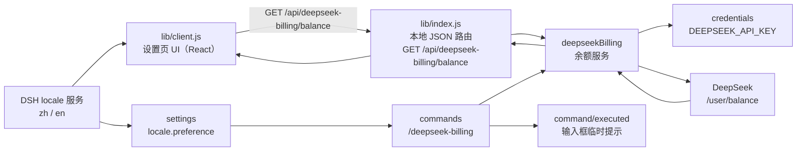

# 概述、设计目标与整体架构

> 本文覆盖原设计文档 §1–§3。设计文档索引见 [README.md](README.md)。

## 1. 概述

`dsh-deepseek-billing` 是一个 **DSH 双端（dual-face）插件**，在 DeepSeek Harness 的 Web 设置页里展示 DeepSeek API 账户余额：

- **宿主半（host half）**：读取 DeepSeek `/user/balance` 接口，以服务 `deepseekBilling` 暴露给宿主，通过本地 HTTP 路由把结果给浏览器，并注册 `/deepseek-billing` 斜杠命令在对话中直接返回余额。
- **客户端半（client half）**：在「设置 → 计费 / Billing」区块渲染余额，接入 DSH 的 `locale` 服务，并把本地执行完成的余额命令结果送到对应会话的输入提示，让新建空白会话保持 Hero 布局；同时为命令列注册专用渲染，隐藏空白阶段执行过的余额命令历史。

两个半共用同一个 npm 包：宿主端通过 bundle patch 注入，客户端通过 `dsh.client` 声明被 `clientModules` 服务扫描进浏览器。

## 2. 设计目标与非目标

### 目标

- 用最少配置把余额展示进 DSH 设置页（无需 `--patch`、无需手动符号链接）。
- 只读展示，不提供充值/改密等写操作。
- 界面文案、时间格式完全跟随 DSH 的 `zh`/`en` 语言选择，实时切换、无需刷新。
- Web 余额查询失败时，HTTP 路由只回稳定错误码，错误文案由客户端按语言翻译，避免英文界面出现中文报错；宿主斜杠命令按已持久化语言直接返回可见文案。
- 凭据只走 DSH 凭证库；插件不另行持久化，也不写入日志、响应或截图。

### 非目标

- 不做汇率换算或币种换算：`currency` 是账户事实，原样透传，不随语言变化。
- 不做余额历史曲线、消耗统计、告警等增值功能。
- 不在插件启动时主动查询余额（避免拖慢启动与无谓的 API 消耗）。

## 3. 整体架构

数据流分三条：

1. **余额链路（请求/响应）**：客户端 `fetch` 本地路由 → 路由调用 `deepseekBilling.getBalance()` → 服务从 `credentials` 解析 `DEEPSEEK_API_KEY` → 携带 `Authorization: Bearer` 请求 DeepSeek `/user/balance` → 校验并白名单化首条余额 → 客户端渲染。
2. **语言链路**：浏览器 `locale` 服务驱动客户端 UI 的文案和时间格式，并把显式选择持久化为宿主 `settings` 的 `locale.preference`；该偏好只影响命令呈现，不改变 DeepSeek 请求。
3. **命令链路**：对话输入 `/deepseek-billing` → 宿主 `commands` 服务复用 `deepseekBilling.getBalance()` → 本地客户端收到 `command/executed` 后，把该命令的成功或错误文本送到对应会话的 composer notice。空白会话保持 Hero，不挂载对话记录页；空白阶段执行过的余额命令在会话激活后由专用命令行插槽隐藏，不会作为历史卡片重新出现。可见文案跟随宿主侧已持久化的 locale 偏好，不可用时回退为无标签余额、破折号、稳定错误码或固定英文用法提示。
